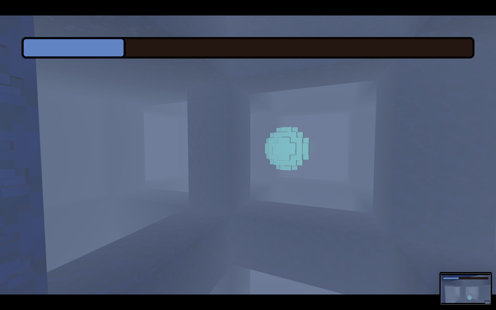
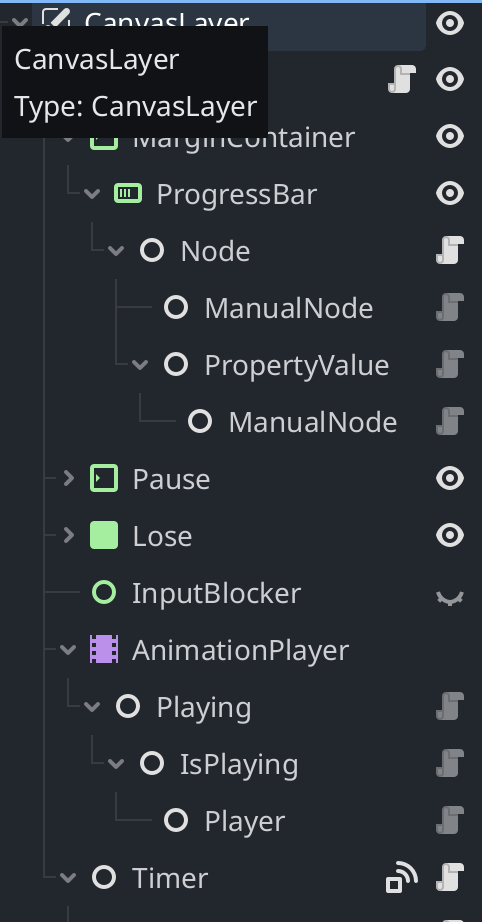
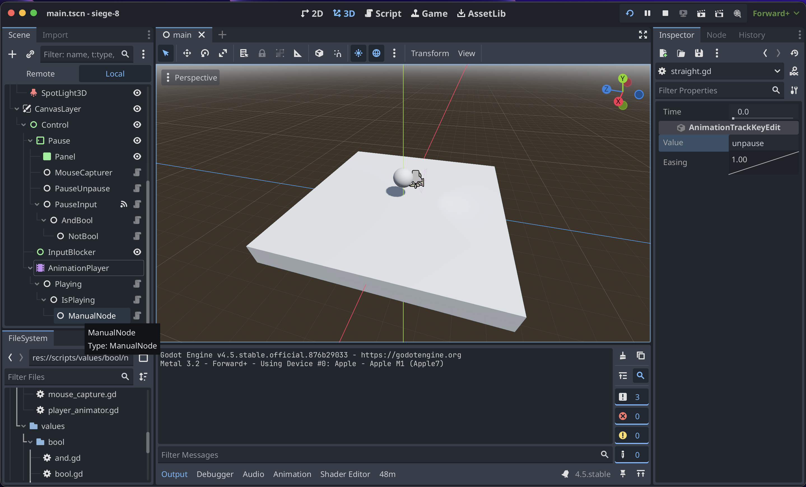
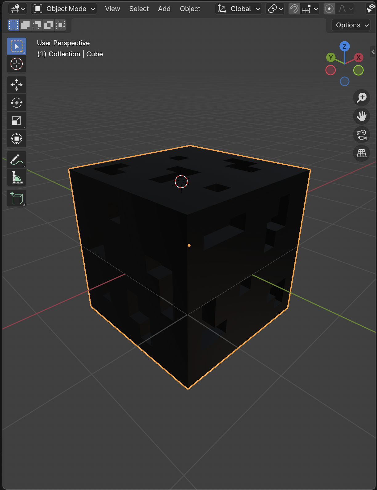
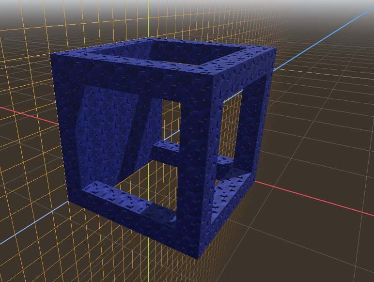
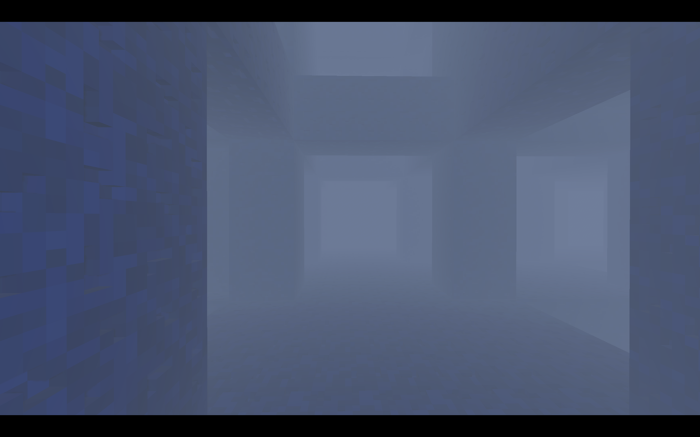
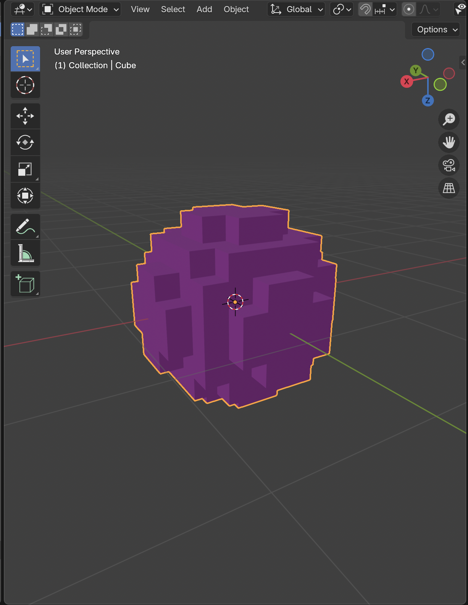

# Liminal Location
A survival game made for Hackclub's Siege Week 8.
The theme this week was Framework.

<video src="assets/videos/demo.mp4" width="320" height="240" controls></video>

---
## Controls
- (W / Up Arrow) -> Move forwards
- (S / Down Arrow) -> Move backwards
- (A / Left Arrow) -> Strafe Left
- (D / Right Arrow) -> Strafe Right
- (Space) -> Strafe upwards
- (Shift) -> Strafe Downwards
- Play [here!](https://baton-0.itch.io/liminal-location)
## Overview
- To comply with the theme, this game was made with a composition *framework*. Everything in the game is made out of small puzzle pieces that talk to each other, and can be reused.
- 
## Credits
- Ambient music is a combo of two tracks, with some effects and tweaks.
    - [close call by davideperico74](https://pixabay.com/music/ambient-close-call-ambient-dark-liminal-space-universe-404960/)
    - [White Noise by Light_Music](https://pixabay.com/music/meditationspiritual-white-noise-188847/)
- The pickup sound is a reverbed piece of [Bag Rustle by freesound_community](https://pixabay.com/sound-effects/bag-rustle-69354/)
    - Everything else is made by me!
---
## Devlogs
### Tuesday -> Setup
- Made the basis for the framework; Bits and Bots.
- Bits introduce functionality, and Bots take on that functionalty. EX, a timer Bit on a Bot would give that Bot a timer.
- [img]
### Wednesday -> Movement
- Made a MoveMasterBit and a MoveBit to handle movement.
- Made a Platformer and WallJump MoveBit, though these were changed later.
### Thursday -> Values
- Changed the game idea to be 3D, and fixed the MoveBits accordingly.
- 
- Added Values, which provide dynamic variables for bits, like getting a group node or adding things together. They're like arguments for Bits.
### Friday -> 3D Setup / Modelling
- Did the 3D models for the cube, as well as two other pieces I didn't end up using.
- 
- Made the gridmap work
- Made the new movement controller, omnidirectional swimming.
- Made a pause menu to capture/uncapture the mouse.
### Sunday -> Ambience / World / Game Loop
- Made the world procedurally generate around the player, and added some fog so you can't see where it ends.
- 
- Added a timer you have to keep topped up by collected pellets.
	- Added Pellet model
	- 
	- Added pellet section
	- Added timer bar / lose screen
- Touched up all the UI
- Added ambient music and a sound effect for picking up pellets.
- Added this README.
